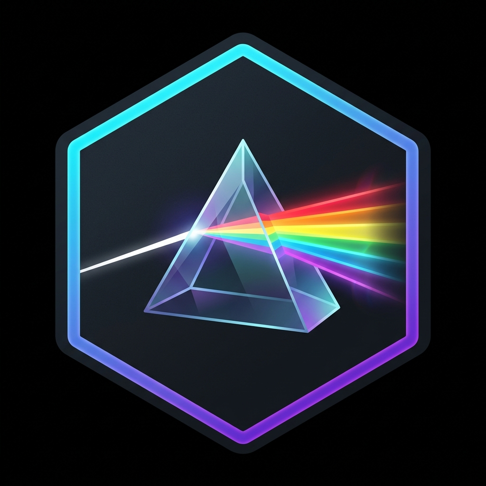

# letsplot-ggprism 

A GraphPad Prism theme and palette package for Python's [Lets-Plot](https://lets-plot.org/) library. 

This package is a port of the popular R package [ggprism](https://github.com/csdaw/ggprism) by csdaw, making it easy to replicate the visual aesthetic of GraphPad Prism graphs using python's `lets-plot`.

## Features

- **`theme_prism()`**: Easy-to-use Lets-Plot theme that mirrors GraphPad Prism style (thick axes, bold text, custom font styling, and optional panel borders).
- **`scale_color_prism()` / `scale_fill_prism()`**: Discrete color/fill scales using all 20+ Prism-specific palettes (e.g. `colors`, `flames`, `candy_bright`, `evergreen`, `prism_light`, etc.).
- **`scale_shape_prism()`**: Point shape scales based on the Prism shape palettes (`default`, `filled`, `complete`).

## Installation

You can install `letsplot-ggprism` directly from your local path or via git:

```bash
pip install git+https://github.com/xpf10/-letsplot-ggprism.git
```

Or using `uv`:

```bash
uv add git+https://github.com/xpf10/-letsplot-ggprism.git
```

## Quickstart

Here is a quick example of how to style a plot using `letsplot-ggprism`:

```python
from lets_plot import *
from letsplot_ggprism import theme_prism, scale_color_prism, scale_shape_prism

LetsPlot.setup_html()

# Sample data
data = {
    "x": [1, 2, 3, 4, 5, 1, 2, 3, 4, 5],
    "y": [2, 3.5, 4, 4.5, 5, 1.5, 3, 3.8, 4.2, 4.8],
    "group": ["A", "A", "A", "A", "A", "B", "B", "B", "B", "B"]
}

# Construct plot
plot = (
    ggplot(data, aes(x="x", y="y", color="group", shape="group"))
    + geom_point(size=4)
    + geom_line(size=1)
    + scale_color_prism(palette="flames")
    + scale_shape_prism(palette="default")
    + theme_prism(palette="flames", base_size=12, border=True)
    + ggtitle("GraphPad Prism Style Plot in Lets-Plot")
)

# Render or save
ggsave(plot, "my_prism_plot.html")
```

## Available Palettes

You can see all available palettes using python:

```python
from letsplot_ggprism import COLOUR_PALETTES, THEME_PALETTES

# List all color palettes
print(list(COLOUR_PALETTES.keys()))

# List all theme palettes
print(list(THEME_PALETTES.keys()))
```

Some popular palettes include:
- `colors` (default Prism colors)
- `flames` (reds and yellows)
- `evergreen` (greens)
- `candy_bright` (vibrant pink, orange, green, blue)
- `colorblind_safe` (optimized for readability)
- `prism_light` / `prism_dark` (themes from newer Prism versions)

## Documentation & Reference Examples

For comprehensive guides and beautiful galleries, check out the documentation site:
- 📖 **[Documentation Home](https://xpf10.github.io/-letsplot-ggprism/)**
- 🎨 **[Palettes Gallery](https://xpf10.github.io/-letsplot-ggprism/palettes/)** — Visual list of all 20+ Prism color/fill palettes.
- ⚙️ **[Themes Guide](https://xpf10.github.io/-letsplot-ggprism/themes/)** — How to use `theme_prism()` and customize fonts, borders, and layouts.
- 📏 **[Scales Guide](https://xpf10.github.io/-letsplot-ggprism/scales/)** — Detailed description of custom shape and color/fill scales.
- 📊 **[Examples Gallery](https://xpf10.github.io/-letsplot-ggprism/examples/)** — Step-by-step advanced plotting examples:
    - [Dose-Response Curve](https://xpf10.github.io/-letsplot-ggprism/examples/#1-dose-response-curve)
    - [ToothGrowth Violin + Boxplot with Significance Bracket](https://xpf10.github.io/-letsplot-ggprism/examples/#2-violin-boxplot-with-significance-bracket)
    - [Bar Chart with Error Bars](https://xpf10.github.io/-letsplot-ggprism/examples/#3-bar-chart-with-error-bars)

*(Alternatively, you can browse the Markdown files directly in this repository: [Examples Gallery](docs/examples.md), [Palettes Gallery](docs/palettes.md), [Themes Guide](docs/themes.md), [Scales Guide](docs/scales.md)).*

## R `ggprism` Comparison

This package maps directly to the features of the original R package, making transition simple:

| R `ggprism` Feature | Python `letsplot-ggprism` | Status |
| --- | --- | --- |
| `theme_prism()` | `theme_prism()` | Fully Supported |
| `scale_colour_prism()` | `scale_color_prism()` / `scale_colour_prism()` | Fully Supported |
| `scale_fill_prism()` | `scale_fill_prism()` | Fully Supported |
| `scale_shape_prism()` | `scale_shape_prism()` | Fully Supported |

## License

MIT License.
