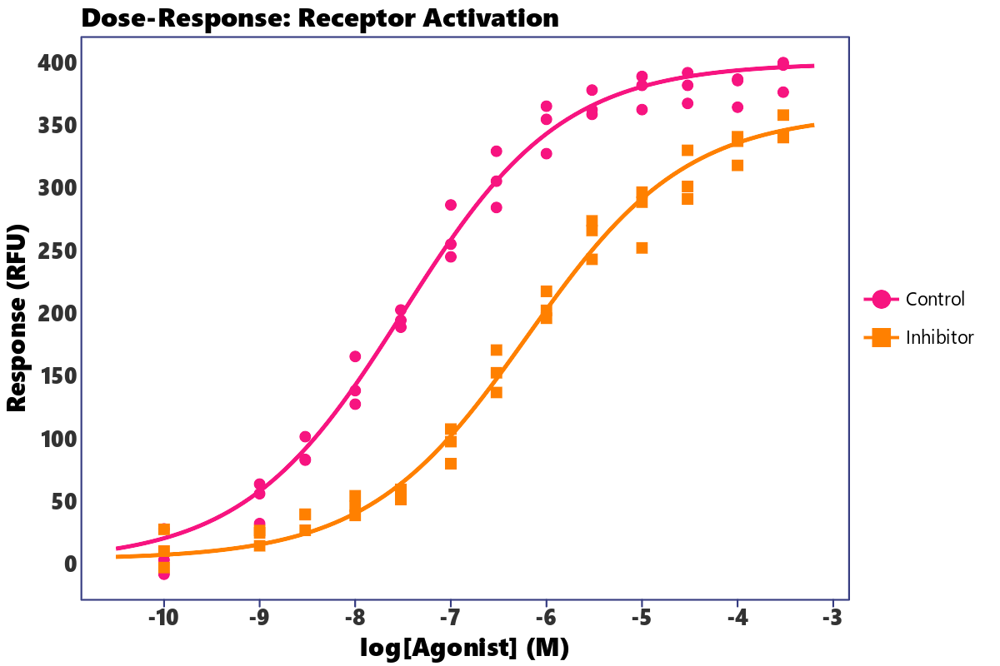
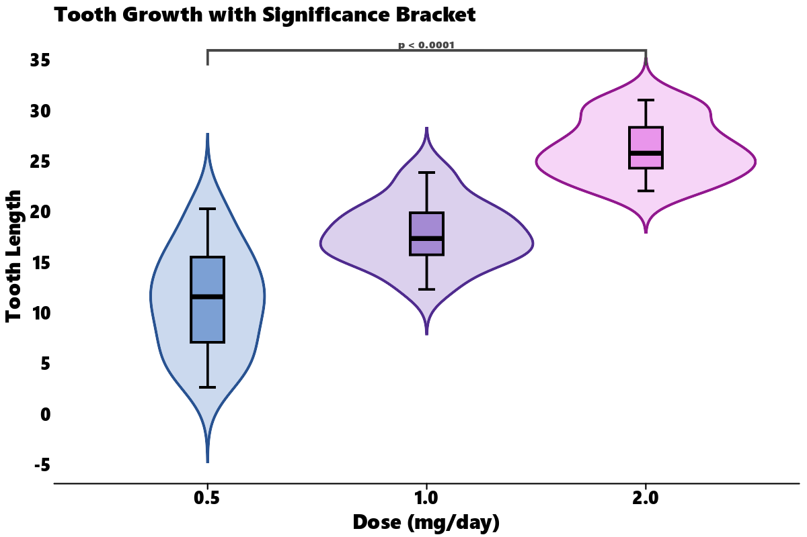
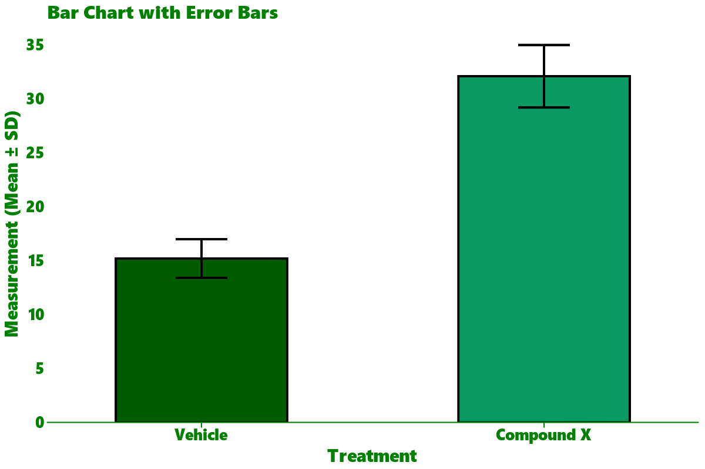

# Examples Gallery

This page showcases advanced examples mimicking plots from the R `ggprism` documentation, demonstrating how to build them in Python using `lets-plot` and `letsplot-ggprism`.

---

## 1. Dose-Response Curve

Dose-response curves are widely used in pharmacology and biology. Since `lets-plot` runs in Python, we can pre-calculate a dense sigmoidal curve using `numpy` and overlay it with our experimental points.

```python
import numpy as np
import pandas as pd
from lets_plot import *
from letsplot_ggprism import theme_prism, scale_color_prism, scale_shape_prism

LetsPlot.setup_html()

# 1. Generate simulated dose-response data
np.random.seed(42)
concentrations = np.array([1e-10, 1e-9, 3e-9, 1e-8, 3e-8, 1e-7, 3e-7, 1e-6, 3e-6, 1e-5, 3e-5, 1e-4, 3e-4])
log_agonist = np.log10(concentrations)

def sigmoid(x, min_val, max_val, ec50, hill):
    return min_val + (max_val - min_val) / (1.0 + np.exp(hill * (ec50 - x)))

# Control group replicates
ctr_y = sigmoid(log_agonist, 2, 400, -7.5, 1.2)
ctr_rep1 = ctr_y + np.random.normal(0, 15, len(log_agonist))
ctr_rep2 = ctr_y + np.random.normal(0, 15, len(log_agonist))
ctr_rep3 = ctr_y + np.random.normal(0, 15, len(log_agonist))

# Inhibitor group replicates (shifted EC50 and reduced max response)
trt_y = sigmoid(log_agonist, 4, 360, -6.2, 1.2)
trt_rep1 = trt_y + np.random.normal(0, 15, len(log_agonist))
trt_rep2 = trt_y + np.random.normal(0, 15, len(log_agonist))
trt_rep3 = trt_y + np.random.normal(0, 15, len(log_agonist))

# Store points in a DataFrame
rows = []
for i, log_x in enumerate(log_agonist):
    for val in [ctr_rep1[i], ctr_rep2[i], ctr_rep3[i]]:
        rows.append({"log_agonist": log_x, "response": val, "group": "Control"})
    for val in [trt_rep1[i], trt_rep2[i], trt_rep3[i]]:
        rows.append({"log_agonist": log_x, "response": val, "group": "Inhibitor"})
df_points = pd.DataFrame(rows)

# Generate dense smooth curves for geom_line
dense_x = np.linspace(-10.5, -3.2, 100)
line_rows = []
for x in dense_x:
    line_rows.append({"log_agonist": x, "response": sigmoid(x, 2, 400, -7.5, 1.2), "group": "Control"})
    line_rows.append({"log_agonist": x, "response": sigmoid(x, 4, 360, -6.2, 1.2), "group": "Inhibitor"})
df_lines = pd.DataFrame(line_rows)

# 2. Build plot
plot = (
    ggplot()
    + geom_line(aes(x="log_agonist", y="response", color="group"), data=df_lines, size=1)
    + geom_point(aes(x="log_agonist", y="response", color="group", shape="group"), data=df_points, size=3)
    + scale_color_prism("candy_bright")
    + scale_shape_prism()
    + theme_prism(palette="candy_bright", border=True)
    + ggtitle("Dose-Response: Receptor Activation")
    + xlab("log[Agonist] (M)")
    + ylab("Response (RFU)")
)
```



---

## 2. Violin & Boxplot with Significance Bracket

This example mirrors the classic `ToothGrowth` plot from the R `ggprism` README. In Lets-Plot, we can use the native `geom_bracket()` to easily add significance brackets between categories.

```python
import numpy as np
import pandas as pd
from lets_plot import *
from letsplot_ggprism import theme_prism, scale_color_prism, scale_fill_prism

LetsPlot.setup_html()

# 1. Generate simulated ToothGrowth-like data
np.random.seed(42)
means = {
    ("OJ", 0.5): 13.23, ("OJ", 1.0): 22.70, ("OJ", 2.0): 26.06,
    ("VC", 0.5): 7.98,  ("VC", 1.0): 16.77, ("VC", 2.0): 26.14
}
sds = {
    ("OJ", 0.5): 4.5, ("OJ", 1.0): 3.9, ("OJ", 2.0): 2.7,
    ("VC", 0.5): 2.7, ("VC", 1.0): 2.5, ("VC", 2.0): 4.8
}

tg_rows = []
for (supp, dose), m in means.items():
    sd = sds[(supp, dose)]
    for val in np.random.normal(m, sd, 10):
        tg_rows.append({"len": val, "supp": supp, "dose": str(dose)})
df_tg = pd.DataFrame(tg_rows)

# 2. Define significance bracket data
bracket_data = {
    "xmin": ["0.5"],
    "xmax": ["2.0"],
    "y": [36.0],
    "label": ["p < 0.0001"]
}

# 3. Build plot
plot = (
    ggplot(df_tg, aes(x="dose", y="len"))
    + geom_violin(aes(color="dose", fill="dose"), trim=False, alpha=0.4)
    + geom_boxplot(aes(fill="dose"), width=0.15, color="black", show_legend=False)
    + geom_bracket(aes(xmin="xmin", xmax="xmax", y="y", label="label"), data=bracket_data, size=4, fontface="bold")
    + scale_color_prism("floral")
    + scale_fill_prism("floral")
    + theme_prism(palette="floral", base_size=14)
    + theme(legend_position="none")
    + ggtitle("Tooth Growth with Significance Bracket")
    + xlab("Dose (mg/day)")
    + ylab("Tooth Length")
)
```



---

## 3. Bar Chart with Error Bars

Another signature style of GraphPad Prism is the bar chart with standard deviation error bars.

```python
import pandas as pd
from lets_plot import *
from letsplot_ggprism import theme_prism, scale_fill_prism

LetsPlot.setup_html()

# 1. Create dataset
df = pd.DataFrame([
    {"condition": "Vehicle", "mean": 15.2, "sd": 1.8, "ymin": 13.4, "ymax": 17.0},
    {"condition": "Compound X", "mean": 32.1, "sd": 2.9, "ymin": 29.2, "ymax": 35.0},
])

# 2. Build plot
plot = (
    ggplot(df, aes(x="condition", y="mean", fill="condition"))
    + geom_bar(stat="identity", width=0.5, color="black", show_legend=False)
    + geom_errorbar(aes(ymin="ymin", ymax="ymax"), width=0.15, color="black", size=0.8)
    + scale_fill_prism("evergreen")
    + theme_prism(palette="evergreen")
    + ggtitle("Bar Chart with Error Bars")
    + xlab("Treatment")
    + ylab("Measurement (Mean ± SD)")
)
```


